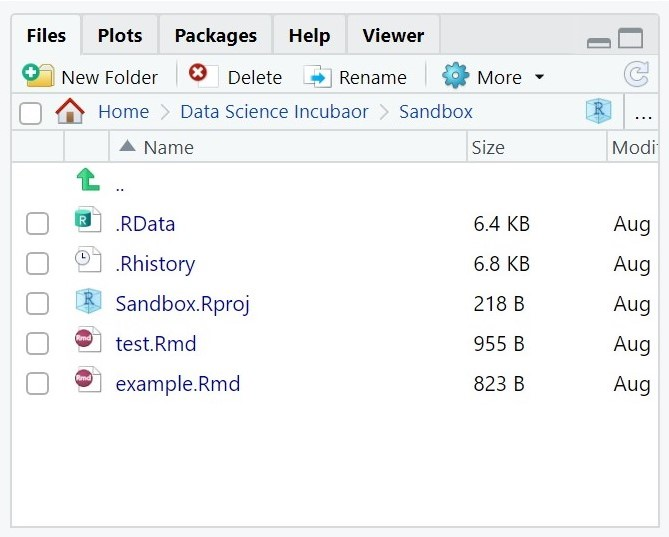
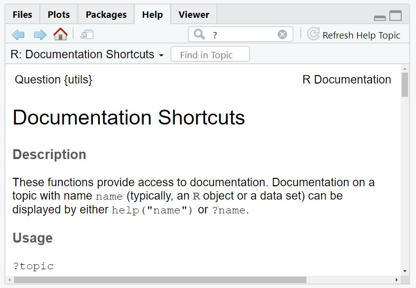
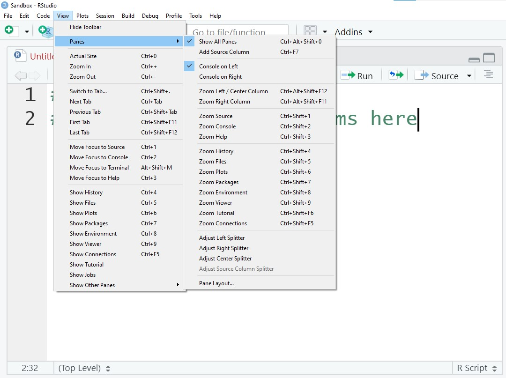
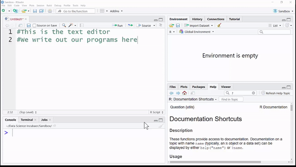

<!-- Code for including shinyJS, currently used for toggling css classes toggleClass() | https://deanattali.com/shinyjs/advanced#usage-prerendered -->
```{r, echo=FALSE}
shiny::addResourcePath("shinyjs", system.file("srcjs", package = "shinyjs"))
```
```{r, context="server"}
shinyjs::useShinyjs(html = TRUE)
```
<script src="shinyjs/inject.js"></script>

<!-- End Code for shinyJs -->
```{r setup, include=FALSE}
library(learnr)
gradethis::gradethis_setup()

##Setup Homework Grade Tracker - keeps track of a student's name, grade, and answers to each homework problem
## WARNING: The default values are set inside the "session_start" event handler, which is inside of homework.Rmd
hmw_info <- NULL

#Uncomment to view all the Learnr events and their data. The data field is not well documented, so this a handy way to view everything
#new_recorder <- function(tutorial_id, tutorial_version, user_id, event, data) {
   #cat("Original: \n", tutorial_id, " (", tutorial_version, "): ", user_id, ", ", event, "\nData:\n", sep = "")
   #print(data)
#}
#options(tutorial.event_recorder = new_recorder)

library(tidyverse)
library(shinyjs)
library(reactable)

addResourcePath("SharedResources", "../SharedResources")#Add access to a shared set of images. Like the banner for the farm dataset
farm_data <- read_csv("../SharedResources/datasets/FarmInventory/data.csv", col_types="ccddffi"); #Homework dataset

knitr::opts_chunk$set(error = FALSE, message = FALSE)
```


## What is R?

### <span style="opacity:0;">r_basics()</span>

 
<p align="center">The R Logo is used courtesy of the R Foundation's <a href="https://www.r-project.org/logo/">CC-BY</a> </p>
  
In this tutorial we'll discuss the basics of R and RStudio. R is a versatile programming language that will empower you
to sift through piles of data and create meaningful visualizations.
*R*Studio is a powerful tool that will help you craft, test, and share your R code.


<!-- ## Why Learn R?  -->

<!--   Todo: Find fun videos on the why they should Learn R --> 
<!-- <div class="video_box"> -->
<!--   <p class="video_header">`r emo::ji("tv")` Video Resource </p> -->
<!--   <p> Before you start your journey on learning R & Rstudio, I'd recommend watching -->
<!--   Allison Horst's Video on "R Art Lessons". She discusses her work on creating educational artwork for -->
<!--   R.</p> -->
<!-- <iframe width="80%" src="https://www.youtube.com/embed/Si-luPC7cdA?controls=1&amp;start=0&end=315" title="YouTube video player" frameborder="0" allow="accelerometer; autoplay; clipboard-write; encrypted-media; gyroscope; picture-in-picture" allowfullscreen></iframe> -->
<!-- </div> -->


## Working in RStudio

--- 

### User Interface {.tabset}

RStudio is what's known as an Integrated Development Environment, or IDE for short. Similar to how
Google Docs provides handy tools for writing a paper (**bolding text**, insert images, spell checking, etc.), an IDE
makes it easier for you to write and test your code. But before you start writing R code, you'll need to know your way around.

#### Big Picture
<p style="margin-top: 15px"> RStudio divides it's user interface into four sections or panes:</p>
<table class="table">
  <tr>
    <td>
      <span class="color1" style="font-weight:bolder">1 The Source </span>
      <p> Write, edit, and save your programs as files (R Markdown). </p>
    </td>
    <td>
      <span class="color2" style="font-weight:bolder">4 The Environment Pane </span>
      <p>Track and view the objects currently held in memory.</p>
    </td>
  </tr>
  <tr>
    <td>
      <span class="color3" style="font-weight:bolder">2 The Console</span>
      <p>Test small snippets of code.</p>
    </td>
    <td>
      <span class="color4" style="font-weight:bolder">3 The Files & Help Pan</span>
      <p>Access your files (upload, download, organize) and view helpful tips.</p>
    </td>
  </tr>
</table>


{width=100%}

#### Source

<p style="margin-top: 15px">The Source pane contains the text editor, which is where you will be writing all of your code. In a later tutorial you'll learn about writing programs in an R Markdown file. These are code-infused documents, which let you blend your R scripts with normal text. 
Have you ever used Google Sheets to create a chart and then had to copy+paste it into a Google Doc? Rmarkdown files are similar except instead of having to create charts in one application and copying them into another to create a report, everything happens in one file!</p>


#### Console

<p style="margin-top: 15px">The console is a handy way to run and test a quick snippet of code. But unlike the code you write in the text editor, nothing is saved after you close RStudio! So make sure you're always saving your work to an R Markdown file.</p>


#### Files and Help

<p style="margin-top: 15px">The lower right pane has quite a few tabs, but the ones we will be most interested in are *Files* and *Help*.</p>

**Files:** With this tab you can navigate the files stored on your computer or online workstation. Since our class is using RStudio online, you'll need to use the *Files* tab to upload files (images, datasets, etc.) you want to work with and later to download your projects so you can submit them for grading.

**Help:** This tab displays documentation for the various libaries and datasets you will be using in class. We'll go into more detail on when you might want to use the help tab later on in this tutorial.




<br style="clear:both;">

#### Environment

<p style="margin-top: 15px">The environment tab lets you see what objects are currently loaded in your session of R. Now if you don't know what an object is, no worries. We have a whole section that discusses what they are and how we use them in this tutorial.</p>


#### Adjust UI 

<p style="margin-top: 15px">Is Rstudio's layout not to your liking? You can adjust the height and width of each of the 4 primary panes of RStudio. You can also modify what tabs/panes are shown under the *View* option in the *Menu* bar.  </p>




<br style="clear:both;">

### The Console

 

For this section of the tutorial we'll only be working with the Console pane. So if your *Source* pane is open, go ahead and minimize it.
Within the console you can write and run small snippets of code. 

#### Math Operations

The most basic of operations in programming are math operations, specifically the ones that handle arithmetic. Below you will
find a table that lists the primary arithmetic operations and the *operator* (or symbol) that represents each. 

<table style="width: 60%; margin: 0 20%; font-size:1.25em"class="table">
  <tr>
    <th style="text-align:center;"> Symbol </th>
    <th style="text-align:left;"> Name </th>
    <th style= "text-align:center; border-left:black 1px solid;"> Symbol </th>
    <th style="text-align:left;"> Name </th>
  </tr>
  <tr>
    <td style="text-align:center;  ">+</td>
    <td>Add</td>
    <td style="text-align:center; border-left:black 1px solid;">-</td>
    <td>Subtract</td>
  </tr>
  <tr>
    <td style="text-align:center; ">*</td>
    <td>Multiply</td>
    <td style="text-align:center; border-left:black 1px solid;">/</td>
    <td>Divide</td>
  </tr>
  <tr>
    <td style="text-align:center; ">^</td>
    <td>Exponent</td>
    <td style="text-align:center; border-left:black 1px solid;">%%</td>
    <td>Modulus</td>
  </tr>
  <tr>
    <td style="text-align:center; ">**</td>
    <td>Exponent</td>
    <td style="text-align:center; border-left:black 1px solid;">%/%</td>
    <td>Integer Division</td>
  </tr>
</table>

Try a few math operations in your RStudio's console. 
```{r}
5 + 2 #Add 5 and 2
```

```{r}
7 ** 3 #Raise 7 to a power of 3
```

```{r}
7 %% 2 #Find the remainder of 7 divided by 2
```

```{r}
7 %/% 2 #Find the result of dividing 7 by 2, as an integer (whole number)
```

## Objects in R

Now you could spend your days using RStudio as a glorified calculator, but you'll quickly want to create more complex pieces of code. 
In order to increase the complexity of your R scripts, you'll need to start storing your values and data in objects. 

### What's an Object?
So what exactly is an object? An object is a way for us to store data in our computer's memory, which we can then access (or reference) with a given name.
The syntax for creating and naming an object in R is as follows:

<p style="font-weight:bold"> <span class="color1">name</span> <span class="color2"><-</span> <span class="color3"> value</span></p>

As an example, the following piece of code will create an object with the value 5. That object can then be referenced with the name *count*.

```{r}
count <- 5
```

Because we provided a name, we can reference our object's value later on in our program.

```{r}
count * 2 #Double the value of count
```

Make sure to always use the *arrow* (<-) as your assignment operator in R. 
For those of you with experience in other programming languages, you might want to use the equals sign (=). 
This will work, but not always! 

<div class="warning_box">
  <p class="warning_header">`r emo::ji("warning")` Warning</p>
  <p> Be careful when writing your R program. R, like all programming languages, is very particular about the
  order in which you write your code. For example, the code below will create an error message! This particular
  error message is letting you know that the *name* has to be to the left side of assignment operator (<-).
  </p>
```{r broken_assignment, R.options=list(width=25), error=TRUE}
5 <- count 
```
</div>

### Naming Conventions

You can create just about as many objects as want, but to make sure your code is readable you'll want to use names that are convey each object's purpose. 

For example, the following piece of code is pretty vague. Do you know what it is calculating?

```{r}
a <- 2
b <- 3
c <- a / b
```

Because the names are just single letters, there is no way to interpret their purposes. All you can really say is that *c* references the quotient of *a* and *b*.
How about we update our code to be a bit more clear:
```{r}
mass <- 2
volume <- 3
density <- mass / volume
```

Now you can clearly tell the code is calculating density! So when you create a name, make sure it follows these rules:  

  * use only lowercase letters and numbers
  * begin with a lowercase letter
  * use underscores (_) to separate words or phrases
  * be **concise** and **meangingful**
  * be a noun phrase
  
This specific style for naming objects is referred to as *snake_case*. Other programming languages have their own naming conventions, such as using camelCase or kebab-case, 
but since this a class that uses R we will follow the naming convention of the R community. 
  
 
<p align="center">"Artwork by <a href="https://twitter.com/allison_horst?lang=en">@allison_horst</a>" </p>


### Types of Objects

So far you have only seen numbers being used for object values, but there are actually three different data types we will be working with. In time, the number of types you work with will grow, but for now we will stick these three basic data types.

 Type | Example | Definition  
------|----------|-----------  
Number    | 2.5  | A numeric value that can be positive or negative and include a decimal or not. This is also known as a *double*.  
Character | "Text" | A piece of text which can contain one or more letters, numbers, or symbols.  
Logical   | TRUE | A value that can only be TRUE or FALSE. This is also known as a *Boolean*.

```{r}
num_apples <- 4000 #Be careful, there are no commas (,) in a number!
```

```{r}
movie_title <- "Honey, I Shrunk the Kids!" #Everything must be between the double quotes (" ") 
``` 

```{r}
is_today_thursday <- FALSE #The logical value must be uppercase and be either TRUE or FALSE
```

#### Vectors

One of R's main strengths, as a programming language, is its ability to quickly and efficiently process large sets of data.
For our class, you will organize collections of data in either a vector, a list, or a data frame. For now, we will just discuss how vectors work.

--- 

A vector is a collection of values that all belong to the same data type.
We typically use the `c()` function to group a set of values together and create a vector. 
Make sure to separate each value in the vector with a comma (,).

```{r}
avg_mpg <- c(31, 22.4, 17)
```

```{r}
student_names <- c("John Doe", "Jane Doe", "A Student With No Name")
```

```{r}
has_valid_id <- c(TRUE, FALSE, FALSE)
```

To access a specific value in your vector, you will need to write it's index (location within the vector) between two square brackets [ ].
**vector_name<span class="color1">[</span><span class="color2">index</span><span class="color1">]</span> **

```{r}
avg_mpg[1] #Access first value in avg_mpg
```

<div class="warning_box">
  <p class="warning_header">`r emo::ji("warning")` Warning</p>
  <p> All values in a vector must be the same type. R will force that type as best it can, often resulting characters.
  </p>
```{r warning_message, R.options=list(width=25)}
mix_of_numbers <- c(1, "4", 5) #Will become characters! 
```
</div>

### Listing the Environment's Objects
As you create larger and larger projects, it can be difficult to keep track of what objects you have currently stored in memory. 
This is where the Environment tab comes in. If you look at your Environment tab it will list all of the names in memory, next to the object they are referencing.
If you end up running out of memory or want to clear everything out, click the "brush" icon.


## Calling Functions {.tabsets}
<p style="font-weight:bolder; font-size:1.75em"><span class="color1">function_name</span>(<span class="color2">argument1</span><span class="color3">argument2</span>, ...)</p>
<!-- Syntax -->
<!-- Arguments, placment, name, and defaults -->


### Loading a library
<!-- Install a package -->
<!-- load a library -->
<!-- Verify it has been loaded: Packages Pane  -->

### Checking the Help pane


