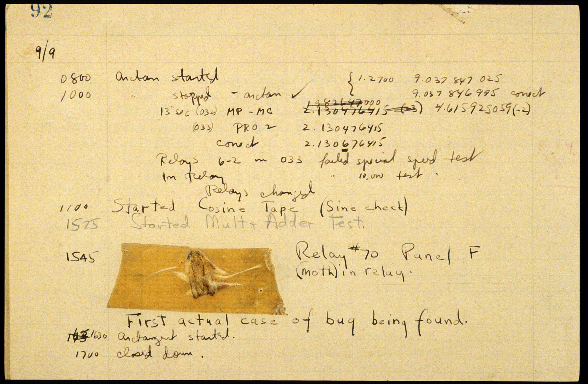

<!-- Code for including shinyJS, currently used for toggling css classes toggleClass() | https://deanattali.com/shinyjs/advanced#usage-prerendered -->
```{r, echo=FALSE}
shiny::addResourcePath("shinyjs", system.file("srcjs", package = "shinyjs"))
```
```{r, context="server"}
shinyjs::useShinyjs(html = TRUE)
```
<script src="shinyjs/inject.js"></script>

<!-- End Code for shinyJs -->
```{r setup, include=FALSE}
library(learnr)
gradethis::gradethis_setup()

##Setup Homework Grade Tracker - keeps track of a student's name, grade, and answers to each homework problem
## WARNING: The default values are set inside the "session_start" event handler, which is inside of homework.Rmd
hmw_info <- NULL

#Uncomment to view all the Learnr events and their data. The data field is not well documented, so this a handy way to view everything
#new_recorder <- function(tutorial_id, tutorial_version, user_id, event, data) {
   #cat("Original: \n", tutorial_id, " (", tutorial_version, "): ", user_id, ", ", event, "\nData:\n", sep = "")
   #print(data)
#}
#options(tutorial.event_recorder = new_recorder)

library(tidyverse)
library(shinyjs)
library(reactable)

addResourcePath("SharedResources", "../SharedResources")#Add access to a shared set of images. Like the banner for the farm dataset

knitr::opts_chunk$set(error = FALSE, message = FALSE)
```


## What is r_markdown()?

### <span style="opacity:0;">r_markdown()</span>

<!-- To create a new banner image: 
  1A) Use the Google Drive Link: https://docs.google.com/drawings/d/1-JEoNvwsXGHAICgMVFXV3bhM2egj54C1WGeu51RsVYk/copy?usp=sharing
  or 
  1B) Copy the Blank Banner.svg file in SharedResources/images
  2) Edit the text to list the name of the tutorial's datset
-->

![Two fuzzy round monsters dressed as wizards, working together to brew different things together from a pantry (code, text, figures, etc.) in a cauldron labeled “R Markdown”. The monster wizard at the cauldron is reading a recipe that includes steps “1. Add text. 2. Add code. 3. Knit. 4. (magic) 5. Celebrate perceived wizardry.” The R Markdown potion then travels through a tube, and is converted to markdown by a monster on a broom with a magic wand, and eventually converted to an output by pandoc. Stylized text (in a font similar to Harry Potter) reads “R Markdown. Text. Code. Output. Get it together, people.”](images/rmarkdown_wizards.png){width=100%} 
<p align="center">"Artwork by <a href="https://twitter.com/allison_horst?lang=en">@allison_horst</a>" </p>
  
If you review the R Documentation for the [r_markdown() function](https://dplyr.tidyverse.org/reference/r_markdown.html) you'll find the following explanation:  

 > Official description for r_markdown() here
 
Add a student friendly explanation for r_markdown() here. Keep in mind, this is all done **without modifying or altering the original dataset!** 

### Why Use R Markdown?

<div class="video_box">
  <p class="video_header">`r emo::ji("tv")` Video Resource </p>
  <p> An embedded video : </p>
 
</div>


## Creating an R Markdown document

### Headers

### Bold and Italics

### Bulleted Lists

### Images


## Loading a dataset

#### Practice Problem 1
Load the *amazon_rainforest.csv* dataset. Display only the first 10 rows, using the `head()` function.
```{r r_markdown_practice1, exercise = TRUE, exercise.blanks = "___+"}
amazon <- read_csv("____/_____/____/_____")
_____
```

```{r r_markdown_practice1-solution}
amazon <- read_csv("data/field_data/jungle/amazon_rainforest.csv")
head(amazon)
```

```{r r_markdown_practice1-code-check}
grade_code()
```

### Debugging your code
![A cartoon of a fuzzy round monster face showing 10 different emotions experienced during the process of debugging code. The progression goes from (1) “I got this” - looking determined and optimistic; (2) “Huh. Really thought that was it.” - looking a bit baffled; (3) “...” - looking up at the ceiling in thought; (4) “Fine. Restarting.” - looking a bit annoyed; (5) “OH WTF.” Looking very frazzled and frustrated; (6) “Zombie meltdown.” - looking like a full meltdown; (7) (blank) - sleeping; (8) “A NEW HOPE!” - a happy looking monster with a lightbulb above; (9) “insert awesome theme song” - looking determined and typing away; (10) “I love coding” - arms raised in victory with a big smile, with confetti falling.](images/debugging.jpg){width=100%} 
<p align="center">"Artwork by <a href="https://twitter.com/allison_horst?lang=en">@allison_horst</a>" </p>

In an ideal world, every line of code you write would run just as you intended it to.
Sadly, that will ***often*** not be the case. A fault or "bug" in your code, 

<div class="further_reading_box">
  <p class="further_reading_header">`r emo::ji("books")` Further Reading</p>
  <p> So where did the terms "bug" and "debugging" come from? According to lore, the term was coined by the famous programmer Grace Hopper. 
  While not entirely true, the story of the "first programming bug" is definitely worth a read. </p>
  
#### {.tabset }

##### The First "Bug"


<p style="text-align:center; font-size:1.5em; margin-top:15px;">`r emo::ji("link")`<a href="https://americanhistory.si.edu/collections/search/object/nmah_334663">A short read on the first programming "bug".</a></p>
{width="100%"}

##### Grace Hopper
<p style="text-align:center; font-size:1.5em; margin-top:15px;">`r emo::ji("link")`<a href="https://president.yale.edu/biography-grace-murray-hopper">A Biography of Grace Hopper</a></p>
{width=100%}
<p style="text-align:center"><a href="https://commons.wikimedia.org/wiki/File:Grace_Murray_Hopper,_in_her_office_in_Washington_DC,_1978,_%C2%A9Lynn_Gilbert.jpg">Image Source</a></td></p>


### <span style="opacity:0;">Blank</span>
### Practice Problems

#### Practice Problem 
Finish the code block, so that ....
```{r r_markdown_practice, exercise = TRUE, exercise.blanks = "___+"}

```

```{r r_markdown_practice-solution}

```

```{r r_markdown_practice-check}
grade_result(
  pass_if(~identical(.result, TRUE))
)
```


## Homework

--- 

<!-- 
  The description for the homework dataset
-->  

<!-- ```{r include_hmw, child="data/hmw_data_description.Rmd"} -->
<!-- ``` -->

<!-- 

  Homework problems are stored in a separate file "homework_#.Rmd", where the # represents a specific set of homework problems.
  To switch homework problems, use the uilities functions updateAllHomeworks(hmw_number) or updateOneHomework(tutorial, hmw_number)
-->

<!--  ```{r, child="homework_1.Rmd"} -->
<!--  ``` -->

<!-- 
  The hmw_grader.Rmd child contains event listeners that evaluate a student's work each time they submit/answer a problem
-->

<!-- ```{r, child="../SharedResources/grading/hmw_grader.Rmd"} -->
<!-- ``` -->

<!-- 
  The download_homework.Rmd child adds a button for students to download their homework submission.
  This report only includes the homework problems and none of the practice problems.
-->

<!-- ```{r, child="../SharedResources/grading/download_homework.Rmd"} -->
<!-- ``` -->


