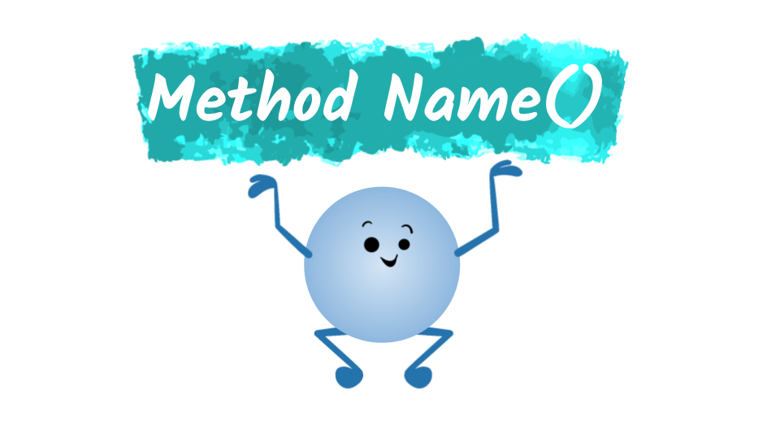
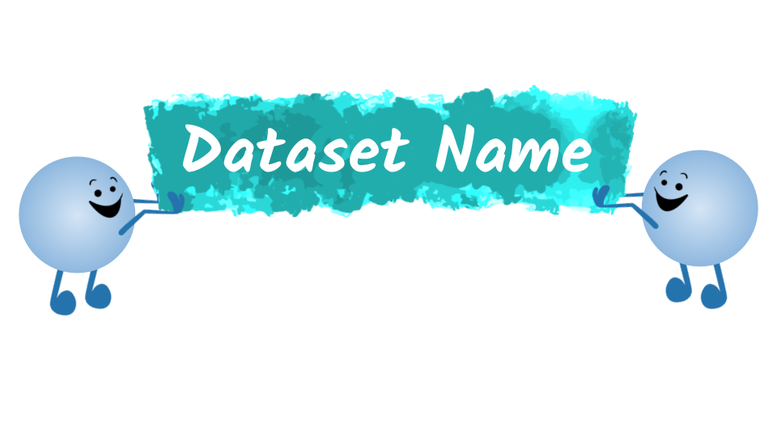

<!-- Code for including shinyJS, currently used for toggling css classes toggleClass() | https://deanattali.com/shinyjs/advanced#usage-prerendered -->
```{r, echo=FALSE}
shiny::addResourcePath("shinyjs", system.file("srcjs", package = "shinyjs"))
```
```{r, context="server"}
shinyjs::useShinyjs(html = TRUE)
```
<script src="shinyjs/inject.js"></script>

<!-- End Code for shinyJs -->
```{r setup, include=FALSE}
library(learnr)
gradethis::gradethis_setup()

##Setup Homework Grade Tracker - keeps track of a student's name, grade, and answers to each homework problem
## WARNING: The default values are set inside the "session_start" event handler, which is inside of homework.Rmd
hmw_info <- NULL

#Uncomment to view all the Learnr events and their data. The data field is not well documented, so this a handy way to view everything
#new_recorder <- function(tutorial_id, tutorial_version, user_id, event, data) {
   #cat("Original: \n", tutorial_id, " (", tutorial_version, "): ", user_id, ", ", event, "\nData:\n", sep = "")
   #print(data)
#}
#options(tutorial.event_recorder = new_recorder)

library(tidyverse)
library(shinyjs)
library(reactable)

addResourcePath("SharedResources", "../SharedResources")#Add access to a shared set of images. Like the banner for the farm dataset
farm_data <- read_csv("../SharedResources/datasets/FarmInventory/data.csv", col_types="ccddffi"); #Homework dataset

knitr::opts_chunk$set(error = FALSE, message = FALSE)
```


## What is filter_lab()?

### <span style="opacity:0;">filter_lab()</span>

<!-- To create a new banner image: 
  1A) Use the Google Drive Link: https://docs.google.com/drawings/d/1-JEoNvwsXGHAICgMVFXV3bhM2egj54C1WGeu51RsVYk/copy?usp=sharing
  or 
  1B) Copy the Blank Banner.svg file in SharedResources/images
  2) Edit the text to list the name of the tutorial's datset
-->

{width=100%} 
<p align="center">"Artwork created with sample graphics provided by <a href="https://twitter.com/allison_horst?lang=en">@allison_horst</a>" </p>
  
If you review the R Documentation for the [filter_lab() function](https://dplyr.tidyverse.org/reference/filter_lab.html) you'll find the following explanation:  

 > Official description for filter_lab() here
 
Add a student friendly explanation for filter_lab() here. Keep in mind, this is all done **without modifying or altering the original dataset!** 

## Practice Dataset  
<!-- All datasets should be stored in the SharedResources/dataset/ directory, 
      inside a folder named after the dataset. The dataset folder should contain the following:
        - data.csv - A csv containing the raw data (if available)
        - description.md - A description of dataset and its variables (a sample is provided below)
        - banner.png - A fun/interesting/informative image to represent the dataset. 
                       Ideally a png file, to allow for easy updates to the tutorial's css styling (specifically background-color)
-->

<!-- To create a new dataset image: 
  1A) Use the Google Drive Link: https://docs.google.com/drawings/d/1fGYXHNHbKQbhU1VlapILNpuhWuhE-9l_UXi0rX_UbgM/copy?usp=sharing 
  or 
  1B) Copy the Blank Dataset.svg file in SharedResources/images
  2) Edit the text to list the name of the tutorial's datset
-->
  
{width=100%} 
<p align="center">"Artwork created with sample graphics provided by <a href="https://twitter.com/allison_horst?lang=en">@allison_horst</a>" </p>

This tutorial's practice exercises will use the [Dataset Name](Dataset URL), which is a (insert description of dataset):\

  - **variable 1** : description 
  - **variable 2**: description  

```{r view_dataset}
#code to retrieve dataset 
#head(dataset)
```


## Basic Syntax  

--- 

<span style="font-weight:bold; font-size:2em"> <span class="color1">results</span> <- filter_lab(<span class="color2">data</span>, <span class="color3" >parameters</span>)</span>

<dl>
  <dt class="color1 medium">results</dt>
  <dd> `filter_lab()` doesn't actually modify the provided dataset, so you'll need to either store the results in order to use them in other operations or use the pipe **%>%** operator to pass the results onto another function.</dd>
  <dt class="color2 medium">data</dt>
  <dd>Here you provide the name of the dataset you want to work with. For most of our practice exercises, that will be the **provided** dataset.</dd>
  <dt class="color3 medium">parameters</dt>
  <dd>Description of parameters. Extra information on the parameters are listed below: </dd>
</dl>  

--- 

```{r}
simple <- tibble(columnA = 24, columnB = 80, columnC = -3, columnD = 11) 
simple
```

--- 

<table class="table">
  <tr>
    <td colspan="2"><p class="color3 medium bolder" style="margin-bottom:0px;">param1</p> Description of param1</td>
  </tr>
  <tr>
    <td> `filter_lab(simple, param1)`</td> 
    <td>
      `#r filter_lab(simple, param1)`
    </td>
  </tr>
  <tr>
    <td colspan="2"><p class="color3 medium bolder" style="margin-bottom:0px;">param2</p> Description of param2</td>
  </tr>
  <tr>
    <td> `filter_lab(simple, param2)`</td> 
    <td>
      `#r filter_lab(simple, param2)`
    </td>
  </tr>
</table> 

<!-- 
  Provided below are examples of three provided call out boxes. 
    Quick Notes     - Gives additional information or demonstrate a handy programming trick 
                      or shortcut for the students to implement.
    Further Reading - Highlights external resources (online articles, pdf files, etc) that students
                      are encouraged to read
    Video Resource  - Shows a youtube or other online video resource for students to watch 
                      within the tutorial
    Warning Box     - Highlights a serious issue for students, like common error messages, 
                      potential misconceptions, or bad coding practices
-->

<div class="quick_note_box">
  <p class="quick_note_header">`r emo::ji("bookmark_tabs")` Quick Note</p>
  <p> A helpful message for the reader:</p>
```{r quick_note, R.options=list(width=25)}
#code example
simple
```
</div>

<div class="further_reading_box">
  <p class="further_reading_header">`r emo::ji("books")` Further Reading</p>
  <p> A link to other resources the reader should read:</p>
```{r further_reading, R.options=list(width=25)}
#code example
simple
```
</div>

<div class="video_box">
  <p class="video_header">`r emo::ji("tv")` Video Resource </p>
  <p> An embedded video : </p>
 
</div>

<div class="warning_box">
  <p class="warning_header">`r emo::ji("warning")` Warning</p>
  <p> A warning message to the reader:</p>
```{r warning_message, R.options=list(width=25)}
#code example
simple
```
</div>

### <span style="opacity:0;">Blank</span>
### Practice Problems

#### Practice Problem 1
Finish the code block, so that ....
```{r filter_lab_practice1, exercise = TRUE, exercise.blanks = "___+"}

```

```{r filter_lab_practice1-solution}

```

```{r filter_lab_practice1-check}
grade_result(
  pass_if(~identical(.result, TRUE))
)
```


## Homework

--- 

<!-- 
  The description for the homework dataset
-->  

```{r include_hmw, child="data/hmw_data_description.Rmd"}
```

<!-- 

  Homework problems are stored in a separate file "homework_#.Rmd", where the # represents a specific set of homework problems.
  To switch homework problems, use the uilities functions updateAllHomeworks(hmw_number) or updateOneHomework(tutorial, hmw_number)
-->
```{r, child="homework_1.Rmd"}
```
<!-- 
  The hmw_grader.Rmd child contains event listeners that evaluate a student's work each time they submit/answer a problem
-->
```{r, child="../SharedResources/grading/hmw_grader.Rmd"}
```
<!-- 
  The download_homework.Rmd child adds a button for students to download their homework submission.
  This report only includes the homework problems and none of the practice problems.
-->
```{r, child="../SharedResources/grading/download_homework.Rmd"}
```


## Additional Practice Problems

--- 

**Warning**: These additional practice problems go beyond what is covered in this tutorial. They are meant to help you strengthen your coding skills. This means that you may have to use new functions, new libraries, or really think "out of the box" to solve them. If you get stuck, make sure to read through the provided hints! 

<!-- 
  When possible, make sure to include additional problems for students to work on. These are placed
  after homework exercises because they go beyond what would be expected for class assignments. Or to 
  put it another way, the homework problems prepare students for future quizzes and exams, but the 
  additional practice problems prepare students for their final project and coding challenges 
  beyond this class.
-->
