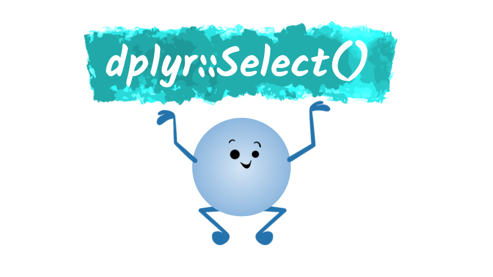

<!-- Code for including shinyJS, currently used for toggling css classes toggleClass() | https://deanattali.com/shinyjs/advanced#usage-prerendered -->
```{r, echo=FALSE}
shiny::addResourcePath("shinyjs", system.file("srcjs", package = "shinyjs"))
```
```{r, context="server"}
shinyjs::useShinyjs(html = TRUE)
```
<script src="shinyjs/inject.js"></script>

<!-- End Code for shinyJs -->
```{r setup, include=FALSE}
library(learnr)
gradethis::gradethis_setup()

##Setup Homework Grade Tracker
## WARNING: The default values are set inside the "session_start" event handler, which is inside of homework.Rmd
hmw_info <- NULL

#Uncomment to view all the Learnr events and their data
#new_recorder <- function(tutorial_id, tutorial_version, user_id, event, data) {
   #cat("Original: \n", tutorial_id, " (", tutorial_version, "): ", user_id, ", ", event, "\n", sep = "")
#}
#options(tutorial.event_recorder = new_recorder)

library(tidyverse)
library(shinyjs)
library(reactable)

shiny::addResourcePath("SharedResources", here::here("SharedResources"))#Needed for accessing images/other files

knitr::opts_chunk$set(error = FALSE, message = FALSE)
```

<!-- 
 Todo: 
    switch to mPG
    Basic:
     - 
   
   COPY CHANGES TO FILTER - Move HOMEWORK setup into a separate file
   
  Helper Functions:
    - Explanations
    - Practice Problems
    - Widgets
    
  Renaming Columns:
    - Explanations
    - Practice Problems
    - Widgets
   
  Homework Problems
-->

## What is select()?

### <span style="opacity:0;">select()</span>

{width=100%} 
<p align="center">"Artwork created with sample graphics provided by <a href="https://twitter.com/allison_horst?lang=en">@allison_horst</a>" </p>
  
If you review the R Documentation for the [select() function](https://dplyr.tidyverse.org/reference/select.html) you'll find the following explanation:  

 > Select (and optionally rename) variables in a data frame, using a concise mini-language that makes it easy to refer to variables based on their name.  
 
In practice, we will use `select()` to help make large datasets more manageable, focusing only on the variables, or columns, we want to work with. `select()` can also be helpful when displaying our datasets, so that we can highlight key variables and improve readability by renaming the often shortened keywords used in datasets (e.g. avg_mpg -> Average Miles Per Gallon). Keep in mind, this is all done **without modifying or altering the original dataset!** 

## Practice Dataset  

```{r list-practice-dataset, child=here::here("SharedResources","datasets","Mpg","description.Rmd")}
```

```{r, echo=FALSE}
head(mpg)
```


## Basic Syntax  

--- 

<span style="font-weight:bold; font-size:2em"> <span class="color1">subset</span> <- select(<span class="color2">data</span>, <span class="color3" >chosen_variables</span>)</span>

<dl>
  <dt class="color1 medium">subset</dt>
  <dd> `select()` doesn't actually modify the provided dataset, so you'll need to either store the results in order to use them in other operations or use the pipe **%>%** operator to pass the results onto another function.</dd>
  <dt class="color2 medium">data</dt>
  <dd>Here you provide the name of the dataset you want to work with. For most of our practice exercises, that will be the **plastic** dataset.</dd>
  <dt class="color3 medium">chosen_variables</dt>
  <dd>This is the most important part for using `select()`, the list of variables you want to keep or remove. This can be as simple as explicitly listing each variable you want to use or be a little more complex by using one of `select()`'s operators. The operators are defined below, along with code examples used on a simple dataset. 
    </dd>
</dl>  

--- 

```{r}
simple <- tibble(columnA = 24, columnB = 80, columnC = -3, columnD = 11) 
simple
```

--- 

<table class="table">
  <tr>
    <td colspan="2"><p class="color3 medium bolder" style="margin-bottom:0px;">name</p> Explicitly name the variable(s) you want to keep and their order.</td>
  </tr>
  <tr>
    <td> `select(simple, columnC, columnA)`</td> 
    <td>
      `r select(simple, columnC, columnA)`
    </td>
  </tr>
  <tr>
    <td colspan="2"> <p class="color3 medium bolder" style="margin-bottom:0px;">position</p> List the position of the variable(s) within the dataset that you want to keep and their new order <br>(i.e. 1 for first, 2 for second, 5 for fifth) </td>
  </tr>
  <tr>
    <td> `select(simple, 2, 4, 1)`</td> 
    <td>
      `r select(simple, 2, 4, 1)`
    </td>
  </tr>
  <tr>
    <td colspan="2"> <p class="color3 medium bolder" style="margin-bottom:0px;">: (colon) </p> Select a range of variables to keep, using either their <span class="color3 bold">names</span> or <span class="color3 bold">positions</span> </td>
  </tr>
  <tr>
    <td> `select(simple, columnB:columnD)`</td> 
    <td>
      `r select(simple, columnB:columnD)`
    </td>
  </tr>
  <tr>
    <td> `select(simple, 1:3)`</td> 
    <td>
      `r select(simple, 1:3)`
    </td>
  </tr>
  <tr>
    <td colspan="2"><p class="color3 medium bolder" style="margin-bottom:0px;">\- (minus)</p> Choose a column to remove, using either its <span class="color3 bold">name</span> or <span class="color3 bold">position</span></td>
  </tr>
  <tr>
    <td> `select(simple, -columnA)`</td> 
    <td>
      `r select(simple, -columnA)`
    </td>
  </tr>
  <tr>
    <td> `select(simple, -3, -4)`</td> 
    <td>
      `r select(simple, -3, -4)`
    </td>
  </tr>
</table> 

<div class="quick_note_box">
  <p class="quick_note_header">`r emo::ji("bookmark_tabs")` Quick Note</p>
  <p> If you ever forget the names of the variables in your dataset, you can use `colnames()` to quickly list them. For example, if you wanted to know the names of the variables in the mpg dataset you would write:</p>
```{r use_colnames, R.options=list(width=25)}
colnames(mpg)
```
</div>

<!-- Add widget here --> 

### <span style="opacity:0;">Blank</span>
### Practice Problems

#### Practice Problem 1
Finish the code block, so that only the variables for the car's model, year, and vehicle type are selected.
```{r select_practice1, exercise = TRUE, exercise.blanks = "___+"}
select(mpg, _____, _____, ____)
```

```{r select_practice1-solution}
select(mpg, model, year, class)
```

```{r select_practice1-check}
grade_result(
  pass_if(~identical(.result, select(mpg, model, year, class)))
)
```

#### Practice Problem 2
Write the necessary code so that only the 4th to the 8th variables are selected.
```{r select_practice2, exercise = TRUE}

```

```{r select_practice2-solution}
select(mpg, 4:8)
```

```{r select_practice2-check}
grade_result(
  pass_if(~identical(.result, select(mpg, 4:8)))
)
```

#### Practice Problem 3
Write the necessary code to remove the drive train and transmission type variables.
```{r select_practice3, exercise = TRUE}

```

```{r select_practice3-solution}
select(mpg, -drv, -trans)
```

```{r select_practice3-check}
grade_result(
  pass_if(~identical(.result, select(mpg, -drv, -trans)))
)
```

#### Practice Problem 4
Write the necessary code to reorder the variables so that the city and highway gas mileage and the fuel type are listed first. 
```{r select_practice4, exercise = TRUE}

```

```{r select_practice4-solution}
select(mpg, cty:fl, manufactorer:drv, class)
```


```{r select_practice4-check}
grade_result(
  pass_if(~identical(.result,select(mpg, cty:fl, manufactorer:drv, class)))
)
```

### Renaming Columns {.tabset}

<p style="font-weight:bold; font-size:1.5em">select(data, <span class="color1" >new_variable_name</span> = <span class="color2">old_variable_name</span>)</p>

To rename a variable using `select()` all you have to do is provide a <span class="color1" >new variable name</span>, however the syntax can be a little awkward since the <span class="color1">new name</span> comes first, before the equals sign (=).

#### Rename with One Word   
The easiest option for renaming a column is to use a single word. Make sure when you are renaming your variables that they still follow good coding practices (lowercase, noun phrase, meaningful).

<table>
  <tr>
    <th>Meaning*ful* Variable Names</th><th>Meaning*less* Variable Names</th>
  </tr>
  <tr>
    <td>
```{r, eval=FALSE}
select(mpg, transmission = trans)
``` 


```{r, echo=FALSE}
head(select(mpg, transmission = trans), n=2)
```

  </td>
  <td>
```{r, eval=FALSE}
select(mpg, transmission = trans)
``` 


```{r, echo=FALSE}
head(select(mpg, t = trans), n=2)
```
  </td>
  </tr>
</table>
#### Rename with Multiple Words  
Be careful when working with multiple words. At first you might try to write out a few words, but be careful variable names cannot contain spaces! Otherwise you'll get an error message like in the code chunk below. Instead make sure to separate your lowercase words with under_scores.
```{r, error=TRUE}
select(mpg, drive train = drv)
```

<table>
  <tr>
    <th>Meaning*ful* Variable Names</th><th>Meaning*less* Variable Names</th>
  </tr>
  <tr>
    <td>
```{r, eval=FALSE}
select(mpg, drive_train = drv)
```

```{r, echo=FALSE}
head(select(mpg, front_rear_or_four_wheel_drive = trans), n=2)
```
  </td>
  <td>
Long winded variable names are unwieldy and prone to typos. Also never use the actual values for a variable as its name! If new values are added or removed, the name would no longer accurately describe the variable's contents/purpose.
```{r, eval=FALSE}
select(mpg, front_rear_or_four_wheel_drive = trans)
``` 


```{r, echo=FALSE}
head(select(mpg, t = trans), n=2)
```
  </td>
  </tr>
</table>

#### Be Careful of " " and .   
When viewing code snippets online, you may see other styles for naming variables with multiple words. But be careful, while some are just different (e.g. CamelCasing) others can be downright problematic. Specifically, don't use dot.notation or "quotation marks".
<table>
  <tr>
    <th>Quotes **"** or **'**</th><th>Dot **.** Notation</th>
  </tr>
  <tr>
    <td>
Double quotes may appear more readable, but it will force all future operations to use quotes as well. Sometimes you will import a dataset where the column names include quotes, but this is consider bad practice.
```{r, eval=FALSE}
select(mpg, "city mpg" = cty)
```

```{r, echo=FALSE}
head(select(mpg, "city mpg" = cty), n=2)
```
  </td>
  <td>
Using dots, i.e. periods, to separate the words in your variable names used to be common practice in R and you can still find plenty of datasets that still follow Dot.Notation, like the `iris` dataset. This practice hasn't fallen out of vogue because it resembles the same notation used by class methods in R. Classes are a topic beyond the scope of this tutorial, so to simplify just **don't use dot.notation**. 
```{r, eval=FALSE}
select(mpg, Fuel.Type = fl)
``` 


```{r, echo=FALSE}
head(select(mpg, Fuel.Type = fl), n=2)
```
  </td>
  </tr>
</table>


## Homwork Problems

<!-- 

  Homework problems are stored in a separate file "homework_#.Rmd", where the # represents a specific set of homework problems.
  In order to prevent 
-->
```{r, child="homework_1.Rmd"}
```
<!-- 
  The hmw_grader.Rmd child contains event listeners that evaluate a student's work each time they submit/answer a problem
-->
```{r, child=here::here("SharedResources","grading","hmw_grader.Rmd")}
```
<!-- 
  The download_homework.Rmd child adds a button for students to download their homework submission.
  This report only includes the homework problems and none of the practice problems.
-->
```{r, child=here::here("SharedResources","grading","download_homework.Rmd")}
```


## Helper Functions

### Using dplyr::rename()  
{width=100%} 

Explain how we rename variables here 


### contains()

### starts_with()

### ends_with()

### num_range()

### everything()

### where()


