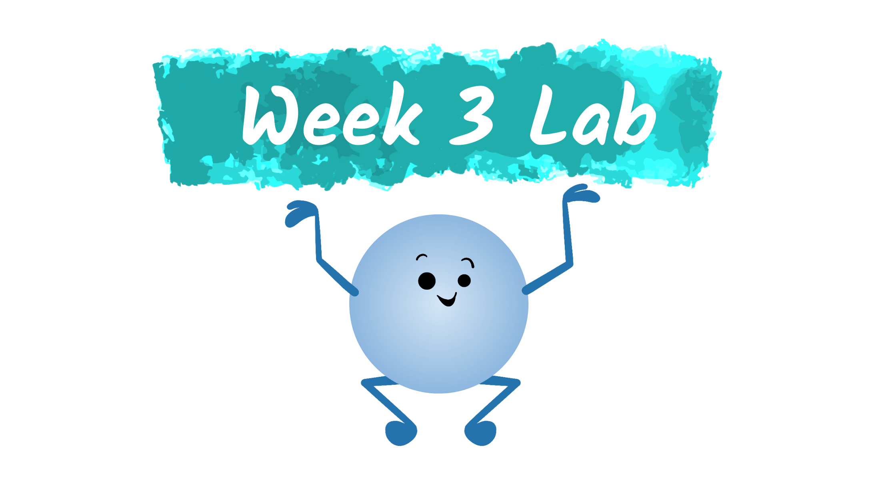

<!-- Code for including shinyJS, currently used for toggling css classes toggleClass() | https://deanattali.com/shinyjs/advanced#usage-prerendered -->
```{r, echo=FALSE}
shiny::addResourcePath("shinyjs", system.file("srcjs", package = "shinyjs"))
```
```{r, context="server"}
shinyjs::useShinyjs(html = TRUE)
```
<script src="shinyjs/inject.js"></script>

<!-- End Code for shinyJs -->
```{r setup, include=FALSE}

library(learnr)
library(palmerpenguins)
library(ahum1825)
gradethis::gradethis_setup()

#Set grading information
hmw_info <- NULL 

#Uncomment to view all the Learnr events and their data. The data field is not well documented, so this a handy way to view everything
#new_recorder <- function(tutorial_id, tutorial_version, user_id, event, data) {
   #cat("Original: \n", tutorial_id, " (", tutorial_version, "): ", user_id, ", ", event, "\nData:\n", sep = "")
   #print(data)
#}
#options(tutorial.event_recorder = new_recorder)

library(tidyverse)
library(shinyjs)
library(reactable)
library(palmerpenguins)
addResourcePath("SharedResources", "../SharedResources")#Add access to a shared set of images. Like the banner for the farm dataset

knitr::opts_chunk$set(error = FALSE, message = FALSE)
```

```{r context="server-start"}
##When the student begins a tutorial or hits "start over" this will reset their homework information. This will clear their
## homework grade and any homework problems submissions currently stored.
event_register_handler("session_start", function(session, event, data) {
  hmw_info <<- reactiveValues(s_id = get_tutorial_info()$user_id,
                           tutorial_name = "Week 3 Lab",
                           hmw_grade = 0.0, 
                           submissions = list(
                                  hmw1 = list(type="code", 
                                               q_text="Fill in the blanks so that only the penguin's island, species, and flipper length are listed.", 
                                               choices="select(penguins, ____, _____, ____)",
                                               is_correct = FALSE, 
                                               submitted_answer = "",
                                               error_msg = ""),
                                  hmw2 = list(type="code", 
                                               q_text="Write a select statement so that only the last 4 columns are listed.", 
                                               choices=NULL,
                                               is_correct = FALSE, 
                                               submitted_answer = "",
                                               error_msg = ""),
                                  hmw3 = list(type="code", 
                                               q_text="Debugging Exercise: Fix the code chunk so the first four variables are listed.", 
                                               choices="select(penguins, species;4)",
                                               is_correct = FALSE, 
                                               submitted_answer = "",
                                               error_msg = ""),
                                  hmw4 = list(type="code", 
                                               q_text="Fill in the blanks so that only the penguins from the Biscoe island are listed.", 
                                               choices="filter(penguins, ______)",
                                               is_correct = FALSE, 
                                               submitted_answer = "",
                                               error_msg = ""),
                                  hmw5 = list(type="code", 
                                               q_text="", 
                                               choices=NULL,
                                               is_correct = FALSE, 
                                               submitted_answer = "List all of the Chinstrap penguins with a bill that is 15 or more millimeters long.",
                                               error_msg = ""),
                                  hmw6 = list(type="code", 
                                               q_text="Debugging Exercise: Fix the code chunk so that only the small penguins, who weigh less than 3 kg, from 2007 and 2008 are listed.", 
                                               choices="filter(penguins, bodyMassG < 3000, year = 2007 | 2008)",
                                               is_correct = FALSE, 
                                               submitted_answer = "",
                                               error_msg = ""),
                                  hmw7 = list(type="code", 
                                               q_text="How many penguins were observed each year?", 
                                               choices=NULL,
                                               is_correct = FALSE, 
                                               submitted_answer = "",
                                               error_msg = ""),
                                  hmw8 = list(type="code", 
                                               q_text="Expand Problem 7, how many penguins of each species were observed each year?", 
                                               choices=NULL,
                                               is_correct = FALSE, 
                                               submitted_answer = "",
                                               error_msg = ""),
                                  hmw9 = list(type="code", 
                                               q_text="Debugging exercise: Fix the code so that you have an accurate count of the penguins from each island.", 
                                               choices="count(penguins, island == \"Dream\")",
                                               is_correct = FALSE, 
                                               submitted_answer = "",
                                               error_msg = ""),
                                  hmw10 = list(type="code", 
                                               q_text="How many penguins on each island have a flipper length over 200mm (exclusive)?", 
                                               choices=NULL,
                                               is_correct = FALSE, 
                                               submitted_answer = "",
                                               error_msg = ""),
                                  hmw11 = list(type="code", 
                                               q_text="How many female penguins have a bill depth between 15.5mm and 17.5mm (inclusive)?", 
                                               choices=NULL,
                                               is_correct = FALSE, 
                                               submitted_answer = "",
                                               error_msg = ""),
                                  hmw12 = list(type="code", 
                                               q_text="How many Chinstrap and Gentoo penguins on each island have a body mass over 4.25 kg?", 
                                               choices=NULL,
                                               is_correct = FALSE, 
                                               submitted_answer = "",
                                               error_msg = "")
                                   ))
})
```


## Week 3 Lab

### <span style="opacity:0;">week-3_lab()</span>

{width=100%} 
<p align="center">"Artwork created with sample graphics provided by <a href="https://twitter.com/allison_horst?lang=en">@allison_horst</a>" </p>
  
For this week's recitation, we will be working through exercises that cover:

<dl>
  <dt>`select()`</dt>
  <dd>This tidyverse function also provides a subset, but of variables (columns). This can make it easier to view your results, by only including the variables you are interested in.</dd>
  <dt>`filter()`</dt>
  <dd>This tidyverse function helps to select a subset of observations (rows) from a datset. This is handy both for exploring your dataset (e.g. how many observations (if any) fit your condition?) or feeding your dataset into a visualization (e.g. create a line graph, but only use the observations that meet your condition)</dd>
  <dt>`count()`</dt>
  <dd>This tidyverse function counts the number of unique values that exist in a variable or a set of variables. This is a great way to see how much variety is in your dataset's variables</dd>
</dl>

## Dataset  

### <span style="opacity:0;">filter practice</span>

```{r load_practice_set, child="../SharedResources/datasets/PalmerPenguins/description.Rmd" }

```  

### <span style="opacity:0;">filter practice</span>

<div class="quick_note_box">
  <p class="quick_note_header">`r emo::ji("bookmark_tabs")` Quick Note</p>
  <p> If you ever forget the names of the variables in your dataset, you can use `colnames()` to quickly list them. Or you can use `?dataset_name` to view the dataset's help page.</p>
```{r use_colnames, R.options=list(width=25)}
colnames(penguins)
```
</div>

```{css, echo=FALSE}
.example{
  border-collapse: collapse;
}
.example td{
  width: 150px;
  height:50px;
  border: 5px solid black;
  padding: 10px;
  font-size:2em;
}

.hightlight{
  background-color: #30B4B4;
}

.valA{
 border-color: #30B4B4 !important;
}

.valAFont{
 color: #30B4B4;
}

.valB{
 border-color: #09E85E !important;
}

.valBFont{
 color: #09E85E;
}

.valC{
  border-color: #FFA69E !important;
}

.valCFont{
 color: #FFA69E;
}

.edge{
  text-align: center;
  border-width: 0px !important;
}

```


## Select

---

### Select a subset of variables (columns)

<table class="example">
  <tr>
    <td class="hightlight"></td>
    <td></td>
    <td class="hightlight"></td>
    <td></td>
  </tr>
  <tr>
    <td class="hightlight"></td>
    <td></td>
    <td class="hightlight"></td>
    <td></td>
  </tr>
  <tr>
    <td class="hightlight"></td>
    <td></td>
    <td class="hightlight"></td>
    <td></td>
  </tr>
  <tr>
    <td class="hightlight"></td>
    <td></td>
    <td class="hightlight"></td>
    <td></td>
  </tr>
  <tr>
    <td class="hightlight"></td>
    <td></td>
    <td class="hightlight"></td>
    <td></td>
  </tr>
</table>

```{r week-3_practice1, exercise = TRUE, exercise.blanks = "___+"}
select(penguins, ____Your_Variables_Here____)
```

### Practice Problems

#### Problem 1 

Fill in the blanks so that only the penguin's island, species, and flipper length are listed.
```{r week-3_hmw1, exercise = TRUE, exercise.blanks = "___+"}
select(penguins, ____, _____, ____)
```

```{r week-3_hmw1-check}
grade_result(
  pass_if(~identical(.result, select(penguins, island, species, flipp_length_mm)))#Replace TRUE with the solution's code
)
```

#### Problem 2 

Write a select statement so that only the last 4 columns are listed.
```{r week-3_hmw2, exercise = TRUE, exercise.blanks = "___+"}

```

```{r week-3_hmw2-check}
grade_result(
  pass_if(~identical(.result, select(penguins, 5:8)))#Replace TRUE with the solution's code
)
```

#### Problem 3
Debugging Exercise: Fix the code chunk so the first four variables are listed.
```{r week-3_hmw3, exercise = TRUE}
select(penguins, species;4)
```

```{r week-3_hmw3-check}
grade_result(
  pass_if(~identical(.result, select(penguins, species:4)))#Replace TRUE with the solution's code
)
```


## Filter  

---

### Filter down to a subset of observations (rows)

<table class="example">
  <tr class="hightlight">
    <td></td>
    <td></td>
    <td></td>
  </tr>
  <tr>
    <td></td>
    <td></td>
    <td></td>
  </tr>
  <tr class="hightlight">
    <td></td>
    <td></td>
    <td></td>
  </tr>
  <tr>
    <td></td>
    <td></td>
    <td></td>
  </tr>
  <tr class="hightlight">
    <td></td>
    <td></td>
    <td></td>
  </tr>
</table>

```{r week-3_practice2, exercise = TRUE, exercise.blanks = "___+"}
filter(penguins, ___Your_Condition_Here____)
```

### Practice Problems

#### Problem 4 

Fill in the blanks so that only the penguins from the Biscoe island are listed.
```{r week-3_hmw4, exercise = TRUE, exercise.blanks = "___+"}
filter(penguins, _______)
```

```{r week-3_hmw4-check}
grade_result(
  pass_if(~identical(.result, filter(penguins, island == "Biscoe")))#Replace TRUE with the solution's code
)
```

#### Problem 5 

List all of the Chinstrap penguins with a bill that is 15 or more millimeters long.
```{r week-3_hmw5, exercise = TRUE, exercise.blanks = "___+"}

```

```{r week-3_hmw5-check}
grade_result(
  pass_if(~identical(.result, filter(penguins, species=="Chinstrap", bill_length_mm >= 15)))#Replace TRUE with the solution's code
)
```

#### Problem 6 

Debugging Exercise: Fix the code chunk so that only the small penguins, who weigh less than 3 kg, from 2007 and 2008 are listed.
```{r week-3_hmw6, exercise = TRUE}
filter(penguins, bodyMassG < 3000, year = 2007 | 2008)
```

```{r week-3_hmw6-check}
grade_result(
  pass_if(~identical(.result, filter(penguins, body_mass_g < 3000, (year == 2007 | year == 2008))))#Replace TRUE with the solution's code
)
```


## Count

---

### Count the number of unique values for a variable or a combination of variables.

<table class="example">
  <tr>
    <td class="valA">Value A</td>
    <td></td>
    <td class="edge"></td>
    <td class="edge"></td>
    <td class="edge"></td>
  </tr>
  <tr>
    <td class="valB">Value B</td>
    <td></td>
    <td class="edge"></td>
    <td class="valAFont">Value A</td>
    <td>2</td>
  </tr>
  <tr>
    <td class="valA">Value A</td>
    <td></td>
    <td class="edge" style="font-size:4em;font-weight:bold;padding:0px;">→</td>
    <td class="valBFont">Value B</td>
    <td>3</td>
  </tr>
  <tr>
    <td class="valC">Value C</td>
    <td></td>
    <td class="edge"></td>
    <td class="valCFont">Value C</td>
    <td>1</td>
  </tr>
  <tr>
    <td class="valB">Value B</td>
    <td></td>
    <td class="edge"></td>
    <td class="edge"></td>
    <td class="edge"></td>
  </tr>
  <tr>
    <td class="valB">Value B</td>
    <td></td>
    <td class="edge"></td>
    <td class="edge"></td>
    <td class="edge"></td>
  </tr>
</table>


```{r week-3_practice3, exercise = TRUE, exercise.blanks = "___+"}
count(penguins, ____Your_Variables_Here____)
```

### Practice Problems

#### Problem 7 

How many penguins were observed each year?
```{r week-3_hmw7, exercise = TRUE, exercise.blanks = "___+"}
count(penguins, _____)
```

```{r week-3_hmw7-check}
grade_result(
  pass_if(~identical(.result, count(penguins, year)))
)
```

#### Problem 8 

Expand Problem 7, how many penguins of each species were observed each year?
```{r week-3_hmw8, exercise = TRUE, exercise.blanks = "___+"}

```

```{r week-3_hmw8-check}
grade_result(
  pass_if(~identical(.result, count(penguins, year, species)))
)
```

#### Problem 9 

Debugging exercise: Fix the code so that you have an accurate count of the penguins from each island.
```{r week-3_hmw9, exercise = TRUE}
count(penguins, island == "Dream")
```

```{r week-3_hmw9-check}
grade_result(
  pass_if(~identical(.result, count(penguins, island)))
)
```


## Building A Pipeline

--- 

### %>% Pip Operator

The pipe operator helps to chain multiple operations in a row. A *pipe*line of operations!


```{r week-3_practice4, exercise = TRUE}
dataset %>% 
  operation1(param1, param2) %>%
  operation2(param1, param2) %>%
  operation3(param1, param2)
```


### Practice Problems

#### Problem 10 

How many penguins on each island have a flipper length over 200mm (exclusive)?
```{r week-3_hmw10, exercise = TRUE}

```

```{r week-3_hmw10-check}
grade_result(
  pass_if(~identical(.result, penguins %>% filter(flipper_length_mm > 200) %>% count(island)))
)
```

#### Problem 11 

How many female penguins have a bill depth between 15.5mm and 17.5mm (inclusive)?
```{r week-3_hmw11, exercise = TRUE}

```

```{r week-3_hmw11-check}
grade_result(
  pass_if(~identical(.result, penguins %>% filter(sex=="female", bill_depth_mm >= 15.5, bill_depth_mm <= 17.5) %>% count()))
)
```

#### Problem 13 

How many Chinstrap and Gentoo penguins on each island have a body mass over 4.25 kg (exclusive)?
```{r week-3_hmw13, exercise = TRUE}

```

```{r week-3_hmw13-check}
grade_result(
  pass_if(~identical(.result, penguins %>% filter(species == "Chinstrap" | species == "Gentoo", body_mass_g > 4250) %>% count(island)))
)
```

---

## Download Results

```{r, child="../SharedResources/grading/hmw_grader.Rmd"}
```

```{r, child="../SharedResources/grading/download_homework.Rmd"}
```
